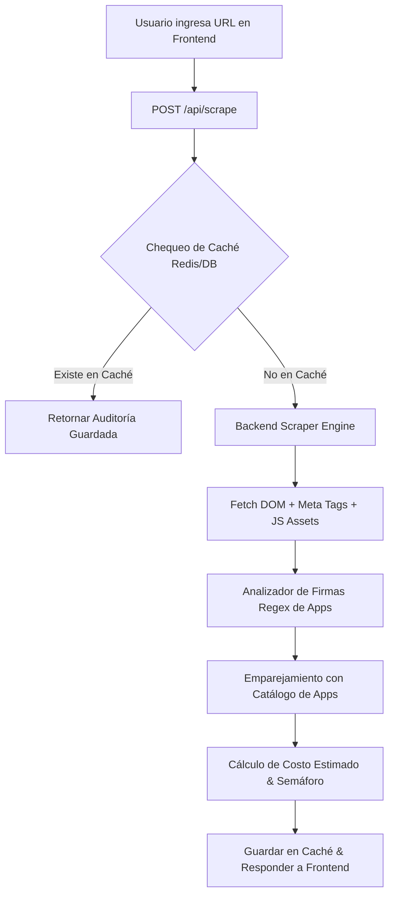
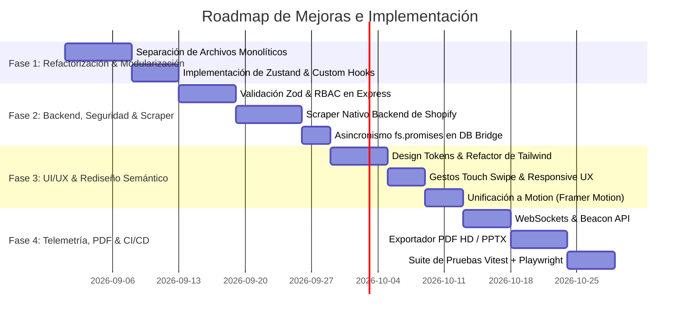

# 🚀 Proposal of Improvements and Structural Changes: Tlamatqui (Evolución Diagnostics)

Este documento contiene un análisis exhaustivo del diseño, la interfaz de usuario (UI/UX), las funcionalidades de negocio y la arquitectura del código fuente de **Tlamatqui**. Presenta un diagnóstico técnico detallado y un plan de acción para transformar la plataforma en una aplicación de nivel empresarial (*Enterprise-Grade*), altamente modular, segura, escalable y con una experiencia visual premium.

---

## 📋 Tabla de Contenidos
1. [Resumen Ejecutivo](#-resumen-ejecutivo)
2. [1. Análisis de Arquitectura y Código](#1-análisis-de-arquitectura-y-código)
   - [1.1 Descomposición de Componentes Monolíticos](#11-descomposición-de-componentes-monolíticos)
   - [1.2 Arquitectura de Estado Global y Custom Hooks](#12-arquitectura-de-estado-global-y-custom-hooks)
   - [1.3 API REST, Validación Estricta con Zod y Seguridad RBAC](#13-api-rest-validación-estricta-con-zod-y-seguridad-rbac)
   - [1.4 Asincronismo y Optimización en DB Bridge](#14-asincronismo-y-optimización-en-db-bridge)
3. [2. Análisis de Diseño e Interfaz de Usuario (UI/UX)](#2-análisis-de-diseño-e-interfaz-de-usuario-uiux)
   - [2.1 Sistema de Diseño Semántico y Design Tokens](#21-sistema-de-diseño-semántico-y-design-tokens)
   - [2.2 Unificación del Motor de Animaciones](#22-unificación-del-motor-de-animaciones)
   - [2.3 Experiencia Responsive y Gestos Touch](#23-experiencia-responsive-y-gestos-touch)
   - [2.4 Accesibilidad (a11y) e Inclusión Visual](#24-accesibilidad-a11y-e-inclusión-visual)
4. [3. Análisis de Funcionalidades y Lógica de Negocio](#3-análisis-de-funcionalidades-y-lógica-de-negocio)
   - [3.1 Scraper Nativo e Inteligente de Tiendas Shopify](#31-scraper-nativo-e-inteligente-de-tiendas-shopify)
   - [3.2 Calculadora Financiera Avanzada de Ahorro y Pasarelas](#32-calculadora-financiera-avanzada-de-ahorro-y-pasarelas)
   - [3.3 Telemetría en Tiempo Real con WebSockets y Beacon API](#33-telemetría-en-tiempo-real-con-websockets-y-beacon-api)
   - [3.4 Exportación Multiformato (PDF HD, PPTX, Excel)](#34-exportación-multiformato-pdf-hd-pptx-excel)
   - [3.5 Control de Acceso por Roles (RBAC) Real en Backend](#35-control-de-acceso-por-roles-rbac-real-en-backend)
5. [4. Análisis de Seguridad, Rendimiento y Despliegue](#4-análisis-de-seguridad-rendimiento-y-despliegue)
   - [4.1 Endurecimiento de Seguridad (Security Hardening)](#41-endurecimiento-de-seguridad-security-hardening)
   - [4.2 Code Splitting & Lazy Loading (Bundle Optimization)](#42-code-splitting--lazy-loading-bundle-optimization)
   - [4.3 Estrategia de Testing y CI/CD](#43-estrategia-de-testing-y-cicd)
6. [5. Roadmap de Implementación (Fases 1 a 4)](#5-roadmap-de-implementación-fases-1-a-4)
7. [6. Matriz Comparativa: Estado Actual vs. Estado Propuesto](#6-matriz-comparativa-estado-actual-vs-estado-propuesto)

---

## 📊 Resumen Ejecutivo

**Tlamatqui** es una herramienta estratégica de alto impacto comercial que permite auditar tiendas Shopify, detectar fugas de margen operativo y presentar escenarios interactivos de ahorro al migrar a Tiendanube.

Tras la revisión técnica del repositorio, se identificaron valiosas fortalezas (arquitectura desacoplada, soporte de persistencia híbrida PostgreSQL/JSON, diseño oscuro moderno y animaciones interactivas). Sin embargo, el proyecto presenta desafíos críticos de **mantenibilidad, rendimiento, seguridad y modularidad**:

- ⚠️ **Archivos Gigantes (Monolitos):** Componentes como `AdminPanel.tsx` (3,650+ líneas), `ReportView.tsx` (2,900+ líneas) y `dbBridge.ts` (1,460+ líneas) concentran lógica de UI, estado, API y negocio en archivos únicos difíciles de probar y escalar.
- ⚠️ **Ausencia de Estado Global Organizado:** Múltiples variables de estado (`useState`) duplicadas se transfieren mediante *prop drilling* extenso.
- ⚠️ **Seguridad en Backend Insuficiente:** Los endpoints de la API REST Express no validan tokens de Auth0 ni restringen operaciones de edición/eliminación por rol de usuario (RBAC).
- ⚠️ **Dependencias de Scraping Externo:** El scraper cliente depende de un servicio de tercero (`chismografo.rifatela.lol`) propenso a caídas y bloqueos.
- ⚠️ **Bloqueo del Event Loop en I/O:** `dbBridge.ts` realiza operaciones de lectura/escritura síncronas en disco (`fs.writeFileSync`), lo que penaliza el throughput bajo concurrencia.

---

## 1. Análisis de Arquitectura y Código

### 1.1 Descomposición de Componentes Monolíticos

#### ❌ Estado Actual
- [AdminPanel.tsx](file:///Users/cesarayar/Documents/tlamatqui/src/components/AdminPanel.tsx) (3,650 líneas) contiene en un solo archivo: el layout del panel, 7 pestañas completas, formularios de edición/creación de reportes, gestores de marcas, selectores de equipos, tablas de auditoría y diálogos modales.
- [ReportView.tsx](file:///Users/cesarayar/Documents/tlamatqui/src/components/ReportView.tsx) (2,968 líneas) agrupa 6 diapositivas interactivas, cálculos de gráficos SVG de dona, lógica de animación con GSAP y Motion, listeners de teclado y sincronización de heartbeat.

#### ✅ Mejora Propuesta
Dividir los componentes gigantescos en una estructura atómica y modular por dominio:

```text
src/
├── components/
│   ├── admin/
│   │   ├── tabs/
│   │   │   ├── ReportsTab.tsx
│   │   │   ├── GlobalDashboardTab.tsx
│   │   │   ├── RealTimeTab.tsx
│   │   │   ├── TeamTab.tsx
│   │   │   ├── TemplatesTab.tsx
│   │   │   ├── PartnerTab.tsx
│   │   │   └── SettingsTab.tsx
│   │   ├── modals/
│   │   │   ├── CreateReportModal.tsx
│   │   │   ├── EditTeamModal.tsx
│   │   │   └── PartnerConfigModal.tsx
│   │   └── shared/
│   │       ├── AdminHeader.tsx
│   │       ├── AdminSidebar.tsx
│   │       └── StatCard.tsx
│   ├── report/
│   │   ├── slides/
│   │   │   ├── Slide1Hero.tsx
│   │   │   ├── Slide2Leaks.tsx
│   │   │   ├── Slide3AppAudit.tsx
│   │   │   ├── Slide4Comparison.tsx
│   │   │   ├── Slide5Calculator.tsx
│   │   │   └── Slide6Closing.tsx
│   │   ├── DonutRingChart.tsx
│   │   ├── SlideNavigationControls.tsx
│   │   └── ReportHeader.tsx
```

---

### 1.2 Arquitectura de Estado Global y Custom Hooks

#### ❌ Estado Actual
- Re-renderizados innecesarios en toda la aplicación debido a cambios de estado locales en la raíz de `AdminPanel` o `ReportView`.
- Peticiones HTTP duplicadas e imperativas con `fetch()` directo repartidas por los componentes sin caché.

#### ✅ Mejora Propuesta
1. **Zustand como Gestor de Estado Global**:
   Crear stores livianos y fuertemente tipados:
   - `useReportStore`: Gestión del reporte activo, lista de reportes, filtros y ordenamiento.
   - `useTeamStore`: Gestión del equipo seleccionado y miembros.
   - `useConfigStore`: Configuración global del panel y tipo de cambio.

2. **Capa de Custom Hooks Especializados**:
   - `useReports()`: Operaciones CRUD de reportes con integración de **TanStack Query (React Query)** para caché automático, reintentos y actualización en segundo plano.
   - `useExchangeRate()`: Gestión del tipo de cambio USD/MXN con actualización automática.
   - `useTelemetry(reportId)`: Encargado de registrar aperturas, permanencia y eventos de clic de forma aislada.

```typescript
// Ejemplo de Store Zustand propuesto: src/stores/useReportStore.ts
import { create } from 'zustand';
import { Report } from '../types';

interface ReportState {
  reports: Report[];
  activeReport: Report | null;
  searchTerm: string;
  setSearchTerm: (term: string) => void;
  setReports: (reports: Report[]) => void;
  setActiveReport: (report: Report | null) => void;
}

export const useReportStore = create<ReportState>((set) => ({
  reports: [],
  activeReport: null,
  searchTerm: '',
  setSearchTerm: (searchTerm) => set({ searchTerm }),
  setReports: (reports) => set({ reports }),
  setActiveReport: (activeReport) => set({ activeReport }),
}));
```

---

### 1.3 API REST, Validación Estricta con Zod y Seguridad RBAC

#### ❌ Estado Actual
- El servidor Express en [server.ts](file:///Users/cesarayar/Documents/tlamatqui/server.ts) acepta cualquier payload JSON (`express.json({ limit: "50mb" })`) sin sanitización ni validación de esquemas.
- Ningún endpoint verifica si la petición proviene de un usuario autenticado o si su rol (`Administrador`, `Editor`, `Visor`) le otorga permisos para la acción.

#### ✅ Mejora Propuesta
1. **Validación de Esquemas con Zod**:
   Crear esquemas de validación para las peticiones POST/PUT de reportes, equipos y configuraciones.
2. **Middleware de Autenticación Auth0 (JWKS)**:
   Verificar tokens Bearer JWT en peticiones al backend utilizando `express-oauth2-jwt-bearer`.
3. **Middleware RBAC (Role-Based Access Control)**:

```typescript
// server/middleware/auth.ts
import { claimCheck } from "express-oauth2-jwt-bearer";

export const requireRole = (allowedRoles: string[]) => {
  return (req: any, res: any, next: any) => {
    const userRole = req.auth?.payload["https://evolucion.mx/role"] || "Visor";
    if (!allowedRoles.includes(userRole)) {
      return res.status(403).json({ error: "Acceso denegado: permisos insuficientes." });
    }
    next();
  };
};
```

---

### 1.4 Asincronismo y Optimización en DB Bridge

#### ❌ Estado Actual
- En [server/dbBridge.ts](file:///Users/cesarayar/Documents/tlamatqui/server/dbBridge.ts), cuando la base de datos PostgreSQL no está activa, las lecturas y escrituras en archivos JSON usan `fs.readFileSync` y `fs.writeFileSync`. Esto bloquea el hilo único de Node.js durante escrituras concurrentes.

#### ✅ Mejora Propuesta
1. Sustituir `fs` por `fs.promises` (`import { promises as fs } from 'fs'`) para ejecutar I/O de archivos de manera verdaderamente asíncrona.
2. Implementar un mecanismo de *debounce* / cola de escritura en el fallback JSON para evitar escrituras repetitivas en disco durante ráfagas de eventos de telemetría.
3. Asegurar que las consultas de Prisma ORM incluyan índices en los campos `teamId`, `createdAt` y `uniqueVisitorIds`.

---

## 2. Análisis de Diseño e Interfaz de Usuario (UI/UX)

### 2.1 Sistema de Diseño Semántico y Design Tokens

#### ❌ Estado Actual
- El código CSS y los componentes utilizan clases de Tailwind con valores hardcodeados heterogéneos (ej. `bg-slate-950`, `bg-slate-900`, `bg-slate-800`, `bg-zinc-900`, `border-blue-500/30`, `text-indigo-400`).
- Esto dificulta el mantenimiento de temas de color consistentes y la personalización visual (*white-label*) para socios comerciales.

#### ✅ Mejora Propuesta
Definir tokens de diseño semánticos en `index.css` utilizando CSS Variables nativas integradas con Tailwind CSS v4:

```css
/* src/index.css */
@theme {
  --color-brand-primary: #2563eb;
  --color-brand-secondary: #0d9488;
  --color-bg-base: var(--bg-base);
  --color-bg-surface: var(--bg-surface);
  --color-bg-card: var(--bg-card);
  --color-border-subtle: var(--border-subtle);
  --color-text-main: var(--text-main);
  --color-text-muted: var(--text-muted);
}

:root {
  --bg-base: #f8fafc;
  --bg-surface: #ffffff;
  --bg-card: #ffffff;
  --border-subtle: #e2e8f0;
  --text-main: #0f172a;
  --text-muted: #64748b;
}

.dark {
  --bg-base: #020617;
  --bg-surface: #0f172a;
  --bg-card: #1e293b;
  --border-subtle: #334155;
  --text-main: #f8fafc;
  --text-muted: #94a3b8;
}
```

---

### 2.2 Unificación del Motor de Animaciones

#### ❌ Estado Actual
- `ReportView.tsx` importa tanto **GSAP** (`import { gsap } from "gsap"`) como **Motion** (`import { motion } from "motion/react"`).
- Cargar dos librerías de animación redundantes incrementa el peso del paquete JavaScript final en aproximadamente 45 KB (gzipped).

#### ✅ Mejora Propuesta
- Estándarizar el 100% de las animaciones de diapositivas, transiciones de modales y micro-interacciones utilizando únicamente **Motion (Framer Motion v12)**, aprovechando sus capacidades nativas de `AnimatePresence`, `layoutId` y gestos.

---

### 2.3 Experiencia Responsive y Gestos Touch

#### ❌ Estado Actual
- La presentación ejecutiva (`ReportView`) en dispositivos móviles requiere pulsar flechas diminutas en pantalla.
- La tabla de auditoría de aplicaciones y la matriz comparativa pueden presentar desbordamiento horizontal sin indicadores visuales de desplazamiento.

#### ✅ Mejora Propuesta
1. **Soporte de Gestos Swipe**: Implementar gestos de deslizamiento lateral (*swipe left / swipe right*) en pantallas táctiles utilizando `motion` para cambiar de diapositiva de forma fluida e intuitiva en celulares y tablets.
2. **Tablas Adaptativas (Card View Fallback)**: En pantallas menores a 640px (`sm`), transformar automáticamente la matriz comparativa de tabla a un formato de tarjetas apiladas.

---

### 2.4 Accesibilidad (a11y) e Inclusión Visual

#### ❌ Estado Actual
- Falta de roles `aria-tab`, `aria-tabpanel`, `aria-expanded` y etiquetas `aria-label` en botones interactivos con solo iconos.
- Algunos elementos de texto gris en modo oscuro tienen un contraste de color por debajo del estándar WCAG AA (4.5:1).

#### ✅ Mejora Propuesta
1. Agregar soporte completo de navegación por teclado (`Tab`, `Shift+Tab`, `Enter`, `Escape`, `Flecha Izquierda/Derecha`).
2. Implementar indicadores visuales claros de enfoque (`focus-visible:ring-2 focus-visible:ring-blue-500`).
3. Auditoría de contraste de color automatizada en CI/CD con axe-core.

---

## 3. Análisis de Funcionalidades y Lógica de Negocio

### 3.1 Scraper Nativo e Inteligente de Tiendas Shopify

#### ❌ Estado Actual
- [src/lib/scrapper.ts](file:///Users/cesarayar/Documents/tlamatqui/src/lib/scrapper.ts) realiza peticiones desde el navegador a una API externa (`chismografo.rifatela.lol/api/analyze`).
- Si la API externa no responde o bloquea la petición (CORS/Rate limit), la app recurre a un simulador local que genera herramientas ficticias a partir de hashes del dominio.

#### ✅ Mejora Propuesta
Construir un **Servicio de Scraping Nativo en el Backend** (Node.js Express Endpoint `/api/scrape`):



**Firmas de Detección en Backend:**
- **Klaviyo:** Script `static.klaviyo.com/onsite/js/klaviyo.js`
- **Loox:** Script `loox.io/widget/` o elementos HTML `.loox-rating`
- **Judge.me:** Script `cdn.judge.me`
- **Gorgias:** Script `config.gorgias.chat`
- **Smile.io:** Variables globales `window.SmileUI`

---

### 3.2 Calculadora Financiera Avanzada de Ahorro y Pasarelas

#### ❌ Estado Actual
- La calculadora de ahorro compara el costo del plan de Shopify + Apps vs Tiendanube, aplicando la comisión por transacción estándar.
- No incluye el desglose de pasarelas de pago locales ni opciones avanzadas de financiamiento.

#### ✅ Mejora Propuesta
Incorporar los siguientes parámetros a la calculadora interactiva:
1. **Simulador de Pasarelas de Pago:**
   - **Pago Nube:** 0% costo por uso de pasarela nativa de Tiendanube.
   - **Mercado Pago / Stripe / PayPal:** Desglose de tasa fija (% + $ MXN fijo por transacción) según el volumen del comercio.
2. **Calculadora de Meses Sin Intereses (MSI):**
   - Comparación de sobretasa bancaria por MSI en Shopify (vía apps de terceros) vs MSI nativos configurables en Tiendanube.
3. **Exportación de Escenarios Financieros:** Botón para guardar diferentes simulaciones (Conservador, Medio, Agresivo) en el reporte.

---

### 3.3 Telemetría en Tiempo Real con WebSockets y Beacon API

#### ❌ Estado Actual
- Cada interacción en la presentación ejecuta un `fetch POST /api/reports/:id/interaction` síncrono.
- Si el usuario cierra la pestaña de forma abrupta, los eventos finales o el tiempo total de permanencia no se registran confiablemente.

#### ✅ Mejora Propuesta
1. **WebSockets (Socket.io) / Server-Sent Events (SSE)**:
   Reemplazar la consulta continua por intervalo (*polling*) del dashboard en tiempo real por una conexión de WebSockets. Cuando un cliente visualiza una diapositiva o hace clic en WhatsApp, el panel de administración recibe la actualización instantáneamente sin latencia.
2. **Navigator.sendBeacon**:
   Utilizar `navigator.sendBeacon('/api/reports/' + id + '/interaction', data)` en el evento `visibilitychange` o `beforeunload` para garantizar que la métrica de tiempo de permanencia se registre siempre, incluso al cerrar la ventana.

---

### 3.4 Exportación Multiformato (PDF HD, PPTX, Excel)

#### ❌ Estado Actual
- La presentación solo puede compartirse mediante enlaces web (`?report=ID&shared=true`). No existe opción para exportar la auditoría a documentos descargables.

#### ✅ Mejora Propuesta
1. **Exportación a PDF HD vectorizado**: Integrar `@react-pdf/renderer` o Puppeteer en el backend para generar un PDF ejecutivo perfectamente diagramado listo para imprimir o enviar por correo.
2. **Exportación a PowerPoint (.pptx)**: Utilizar `pptxgenjs` para generar presentaciones editables de 6 diapositivas para reuniones de ventas presenciales.
3. **Exportación a Excel / CSV**: Descargar la matriz de auditoría de aplicaciones y comparación de costos.

---

### 3.5 Control de Acceso por Roles (RBAC) Real en Backend

#### ❌ Estado Actual
- Los roles de usuario (`Administrador`, `Editor`, `Visor`) se almacenan en el perfil pero no restringen las rutas de la API en `server.ts`.

#### ✅ Mejora Propuesta
Matriz de permisos estricta a implementar en el backend:

| Acción / Endpoint | Visor | Editor | Administrador |
| :--- | :---: | :---: | :---: |
| `GET /api/reports` | ✅ | ✅ | ✅ |
| `POST /api/reports` | ❌ | ✅ | ✅ |
| `PUT /api/reports/:id` | ❌ | ✅ | ✅ |
| `DELETE /api/reports/:id` | ❌ | ❌ | ✅ |
| `POST /api/teams` | ❌ | ❌ | ✅ |
| `POST /api/config` | ❌ | ❌ | ✅ |

---

## 4. Análisis de Seguridad, Rendimiento y Despliegue

### 4.1 Endurecimiento de Seguridad (Security Hardening)

#### Acciones Prioritarias:
1. **Protección de Cabeceras HTTP:** Integrar `helmet` en Express para configurar cabeceras de seguridad (`Content-Security-Policy`, `X-Frame-Options`, `X-Content-Type-Options`).
2. **Control de Tasa de Peticiones (Rate Limiting):** Implementar `express-rate-limit` en `/api/*` (máximo 100 peticiones por 15 minutos por IP) y en `/api/scrape` (máximo 10 peticiones por minuto).
3. **CORS Restringido:** Reemplazar `cors({ origin: true })` por una lista blanca de orígenes permitidos configurables por variable de entorno (`ALLOWED_ORIGINS`).

---

### 4.2 Code Splitting & Lazy Loading (Bundle Optimization)

#### ❌ Estado Actual
Actualmente, todo el código frontend se compila en un único bloque. Los visitantes públicos que abren un reporte compartido cargan también todo el código del `AdminPanel`, `GlobalDashboard`, `TeamDashboard`, etc.

#### ✅ Mejora Propuesta
Implementar carga diferida (`React.lazy` y `Suspense`) en `App.tsx`:

```typescript
// src/App.tsx refactorizado
import React, { lazy, Suspense } from 'react';

const AdminPanel = lazy(() => import('./components/admin/AdminPanel'));
const ReportView = lazy(() => import('./components/report/ReportView'));
const LoginPage = lazy(() => import('./components/LoginPage'));

// Los usuarios públicos de reportes cargan un bundle de ~80KB en lugar de ~650KB.
```

---

### 4.3 Estrategia de Testing y CI/CD

#### Propuestas:
1. **Pruebas Unitarias e Integración (Vitest + React Testing Library)**:
   - Cobertura de la calculadora de ahorros (`src/lib/calculator.test.ts`).
   - Pruebas del puente de datos híbrido (`server/dbBridge.test.ts`).
2. **Pruebas End-to-End (Playwright)**:
   - Flujo completo: Login -> Crear Reporte -> Ejecutar Scraper -> Visualizar Diapositivas -> Simular Ahorro.
3. **Pipeline de Integración Continua (GitHub Actions)**:
   - Ejecución de `tsc --noEmit`, ESLint, Vitest y auditoría de seguridad `npm audit` en cada Pull Request.

---

## 5. Roadmap de Implementación (Fases 1 a 4)



### Detalle de Fases:

#### 🔹 Fase 1: Refactorización Estructural y Estado (Semanas 1-2)
- Descomponer `AdminPanel.tsx` y `ReportView.tsx` en subcomponentes por dominio.
- Instalar e implementar **Zustand** y **TanStack Query**.
- Configurar rutas perezosas (*Code Splitting*) con `React.lazy`.

#### 🔹 Fase 2: Backend, Seguridad y Scraper Nativo (Semanas 3-4)
- Crear middleware de autenticación JWT y RBAC en Express.
- Desarrollar el motor de scraping nativo en el backend para auditar dominios Shopify sin dependencias externas.
- Migrar `dbBridge.ts` a `fs.promises` con cola de escrituras asíncronas.

#### 🔹 Fase 3: Rediseño Visual, Tokens Semánticos y UX Móvil (Semanas 5-6)
- Implementar la paleta de tokens semánticos en `index.css`.
- Eliminar la dependencia de GSAP y unificar animaciones en Motion.
- Añadir gestos táctiles *swipe* y vistas adaptativas de tablas para dispositivos móviles.

#### 🔹 Fase 4: Telemetría Avanzada, Exportación y CI/CD (Semanas 7-8)
- Implementar comunicación en tiempo real con WebSockets (Socket.io) y `navigator.sendBeacon`.
- Desarrollar el módulo de exportación a PDF HD (`@react-pdf/renderer`) y PowerPoint (`pptxgenjs`).
- Configurar la suite de pruebas automatizadas y el pipeline en GitHub Actions.

---

## 6. Matriz Comparativa: Estado Actual vs. Estado Propuesto

| Criterio / Área | Estado Actual (v2.5.0) | Estado Propuesto (v3.0.0) |
| :--- | :--- | :--- |
| **Mantenibilidad del Código** | Monolitos de 3,600+ y 2,900+ líneas en un solo archivo. | Arquitectura atómica modular con archivos menores a 250 líneas. |
| **Gestión de Estado** | `useState` local con *prop drilling* de 5+ niveles. | Estado global optimizado con **Zustand** y caché con **TanStack Query**. |
| **Seguridad de la API REST** | Endpoints públicos sin validación de roles ni JWT. | Middleware JWT Auth0, validación Zod y RBAC por rol. |
| **Motor de Scraping** | Llamada a servicio externo inseguro e inestable. | Motor nativo backend con inspección de DOM, scripts y caché. |
| **Rendimiento I/O (DB Bridge)** | Operaciones síncronas en disco (`fs.writeFileSync`). | Lectura/escritura 100% asíncrona (`fs.promises`) con colas. |
| **Carga Inicial (Bundle Size)** | Monolítico (~650 KB gzipped) cargado completo siempre. | *Code Splitting* por ruta (~80 KB gzipped para vista pública de reporte). |
| **Motor de Animación** | Mezcla redundante de GSAP y Motion. | Animaciones unificadas en **Motion (Framer Motion v12)**. |
| **Telemetría en Vivo** | Polling HTTP cada 3 segundos + peticiones síncronas. | **WebSockets (Socket.io)** en tiempo real + `navigator.sendBeacon`. |
| **UX Móvil** | Flechas táctiles pequeñas sin gestos nativos. | Gestos táctiles *Swipe* + vistas adaptativas de tablas a tarjetas. |
| **Exportación de Reportes** | Exclusivamente via URL web interactiva. | Generación nativa de **PDF HD vectorizado**, **PowerPoint (PPTX)** y **Excel**. |

---

> [!TIP]
> **Conclusión:** La implementación de estas propuestas transformará **Tlamatqui** en una plataforma de software sumamente robusta, segura y mantenible, posicionándola como la suite de diagnóstico y auditoría e-commerce de referencia para agencias y consultores comerciales.
